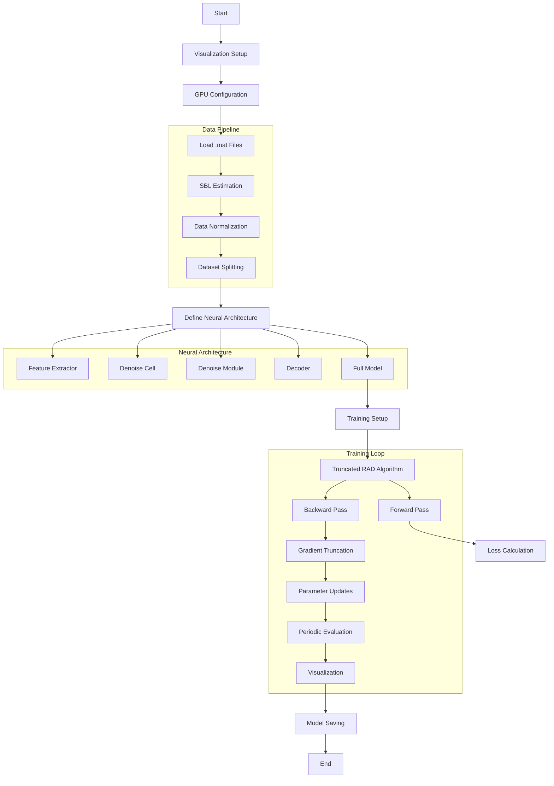

# 6G-efforts
Efforts towards 6G.

### Flowchart:

```mermaid
graph TD
    A[Start] --> B[Visualization Setup]
    B --> C[GPU Configuration]
    C --> D[Load .mat Files]
    D --> E[SBL Estimation]
    E --> F[Data Normalization]
    F --> G[Dataset Splitting]
    G --> H[Define Neural Architecture]
    H --> I[Feature Extractor]
    H --> J[Denoise Cell]
    H --> K[Denoise Module]
    H --> L[Decoder]
    H --> M[Full Model]
    M --> N[Training Setup]
    N --> O[Truncated RAD Algorithm]
    O --> P[Forward Pass]
    O --> Q[Backward Pass]
    P --> R[Loss Calculation]
    Q --> S[Gradient Truncation]
    S --> T[Parameter Updates]
    T --> U[Periodic Evaluation]
    U --> V[Visualization]
    V --> W[Model Saving]
    W --> X[End]
    
    subgraph Training Loop
        O
        P
        Q
        S
        T
        U
        V
    end
    
    subgraph Neural Architecture
        I
        J
        K
        L
        M
    end
    
    subgraph Data Pipeline
        D
        E
        F
        G
    end
```
